# Tarangini Workflow Suite - All Transaction UML

Generated from the current source architecture. `IMPLEMENTED` means the workflow exists in the present application. `PROPOSED - NOT BUILT` is a reviewed future design only.

## End-to-End Transaction Spine

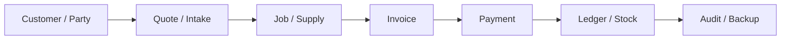

## 1. Login, Session and Role Authorization

**Status:** IMPLEMENTED  
**Actors:** Owner, counter, finance, operator, engineer  
**Purpose:** Authenticates the user, creates a server session and applies company and role permissions to every protected request.

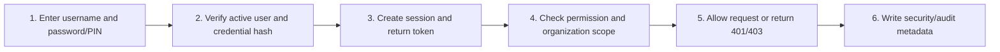

- Accounting effect: None
- Stock effect: None
- Main records: users, sessions, audit_log
- Key controls: Expiry, role permissions, org scope, owner-only actions

## 2. Company, User and Permission Administration

**Status:** IMPLEMENTED  
**Actors:** Owner1  
**Purpose:** Creates companies and staff accounts, assigns organization access and limits billing, accounting, reporting and job functions.

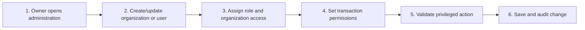

- Accounting effect: No direct posting
- Stock effect: No direct movement
- Main records: orgs, users, transaction_control_settings, audit_log
- Key controls: Owner-only administration; no cross-org access without permission

## 3. Party, Shared Organization and Address Book

**Status:** IMPLEMENTED  
**Actors:** Owner, permitted billing staff  
**Purpose:** Creates a customer/vendor, optionally shares it with selected companies and stores multiple billing, delivery, branch or site addresses.

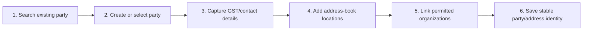

- Accounting effect: Opening balance may post receivable/payable
- Stock effect: None
- Main records: parties, party_org_links, party_addresses, journal_entries
- Key controls: Same-name parties distinguished by ID, GSTIN, phone and address

## 4. Item, Service, Barcode and Opening Stock

**Status:** IMPLEMENTED  
**Actors:** Owner, inventory staff  
**Purpose:** Creates products/services with HSN/SAC, rates, barcode, opening stock and reorder level for billing and job material use.

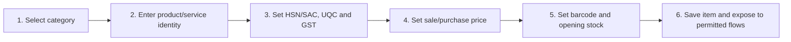

- Accounting effect: No direct journal from item master
- Stock effect: Opening stock becomes stock-report baseline
- Main records: item_categories, items
- Key controls: Organization ownership, unique item identity, active/inactive state

## 5. Quotation Transaction

**Status:** IMPLEMENTED  
**Actors:** Owner, counter, permitted operator  
**Purpose:** Records a priced offer using a stable party and address snapshot without posting accounting or reducing stock.

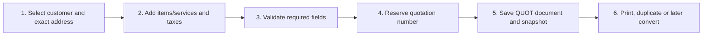

- Accounting effect: None until converted to SALE
- Stock effect: None until converted to SALE
- Main records: bills(format=QUOT), bill_sequences, audit_log
- Key controls: FY numbering, party snapshot, operator edit reason

## 6. Delivery Challan Transaction

**Status:** IMPLEMENTED  
**Actors:** Owner, counter  
**Purpose:** Records goods delivered or dispatched with delivery-party details and can later become the linked sale invoice.

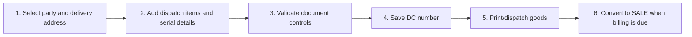

- Accounting effect: None until converted
- Stock effect: Current implementation posts stock on resulting SALE
- Main records: bills(format=DC), bill_sequences, audit_log
- Key controls: Document number never reused; stable delivery snapshot

## 7. Proforma Invoice Transaction

**Status:** IMPLEMENTED  
**Actors:** Owner, finance, counter  
**Purpose:** Creates a non-accounting advance invoice document that can later be converted into the final sale invoice.

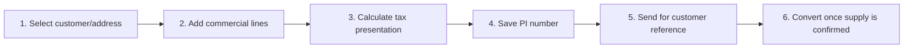

- Accounting effect: None until converted
- Stock effect: None until converted
- Main records: bills(format=PI), bill_sequences, audit_log
- Key controls: Conversion creates a new SALE and preserves source reference

## 8. Sale, POS and Project-Printing Invoice

**Status:** IMPLEMENTED  
**Actors:** Owner, counter, permitted operator  
**Purpose:** Creates the fiscal sale document, posts tax and receivable/cash/bank journals, and reduces stock for product lines.

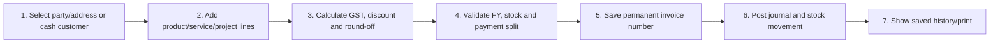

- Accounting effect: Debit cash/bank/receivable; credit sales and output GST
- Stock effect: SALE quantity out for inventory items
- Main records: bills, journal_entries, journal_lines, stock_movements, audit_log
- Key controls: Atomic save, FY lock, number non-reuse, org/party validation

## 9. Invoice Edit, Owner Delete and Invoice Correction

**Status:** IMPLEMENTED  
**Actors:** Creator with reason; Owner for delete/approval  
**Purpose:** Controls changes to saved invoices, protects numbering and rebuilds the related accounting/stock effects safely.

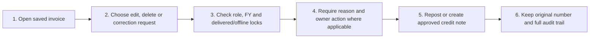

- Accounting effect: Repost journal or post credit-note reversal
- Stock effect: Replace/remove movements or return stock where applicable
- Main records: bills, invoice_correction_requests, credit_debit_notes, audit_log
- Key controls: Soft delete; mandatory reason; numbers never renumbered

## 10. Duplicate and Cross-Organization Voucher

**Status:** IMPLEMENTED  
**Actors:** Owner, permitted staff  
**Purpose:** Copies an existing voucher as a new draft/transaction while requiring valid target-company party, address, item and account identities.

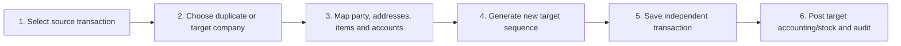

- Accounting effect: New posting only for accounting voucher types
- Stock effect: New movement only for stock-changing types
- Main records: bills/payments/purchases/expenses/notes/journals/PO, audit_log
- Key controls: No source ID reuse; cross-org mapping validation

## 11. Payment Received and Invoice Allocation

**Status:** IMPLEMENTED  
**Actors:** Owner, finance, counter  
**Purpose:** Records money received, optionally into a personal/bank/cash ledger, and allocates it to one or more invoices.

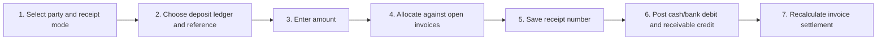

- Accounting effect: Debit selected cash/bank; credit receivable or other income
- Stock effect: None
- Main records: payments(type=received), payment_allocations, journal_entries
- Key controls: Allocation cannot exceed valid amount; FY/shift controls

## 12. Payment Paid / Expense Settlement

**Status:** IMPLEMENTED  
**Actors:** Owner, finance  
**Purpose:** Records outgoing cash/bank payment to a vendor or general expense destination.

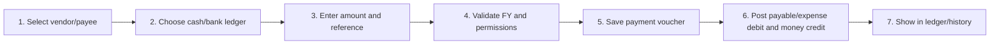

- Accounting effect: Debit payable/general expense; credit cash/bank
- Stock effect: None
- Main records: payments(type=paid), journal_entries, journal_lines
- Key controls: Owner/finance permission, immutable number, audit

## 13. Owner Approval for Payment Corrections

**Status:** PROPOSED - NOT BUILT  
**Actors:** Requester: operator/counter; Approver: owner  
**Purpose:** Proposed controlled correction that preserves the original payment and applies a reversal plus corrected replacement only after owner approval.

```mermaid
flowchart LR
  S1["1. Requester opens saved payment"]
  S2["2. Submit reason and proposed values"]
  S3["3. Capture old/new snapshots and impact"]
  S4["4. Owner approves, rejects or returns"]
  S5["5. On approval reverse original posting"]
  S6["6. Create corrected replacement and allocations"]
  S7["7. Notify requester and seal audit"]
  S1 --> S2 --> S3 --> S4 --> S5 --> S6 --> S7
  classDef proposed fill:#fff2d8,stroke:#e9a23b,color:#243b53;
  class S1,S2,S3,S4,S5,S6,S7 proposed;
```

- Accounting effect: Reversal plus replacement; never silent in-place overwrite
- Stock effect: None
- Main records: Proposed payment_correction_requests plus existing payment/journal tables
- Key controls: Owner re-authentication, idempotency, closed-FY exception handling

## 14. Purchase Order to Purchase Voucher

**Status:** IMPLEMENTED  
**Actors:** Owner, purchase/finance staff  
**Purpose:** Creates a vendor order without accounting impact, then converts accepted supply into a purchase voucher.

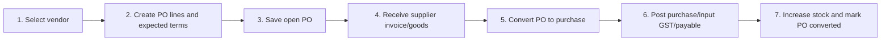

- Accounting effect: At conversion: debit purchase/input GST; credit payable/cash/bank
- Stock effect: Purchase quantity in
- Main records: purchase_orders, purchases, journal_entries, stock_movements
- Key controls: Only open PO converts; new purchase number generated

## 15. Direct Purchase Voucher

**Status:** IMPLEMENTED  
**Actors:** Owner, finance/purchase staff  
**Purpose:** Records supplier goods/services, input tax, payable or immediate payment and inventory receipt.

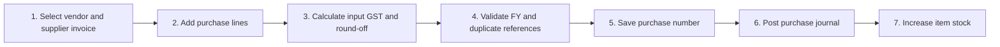

- Accounting effect: Debit purchases/input GST; credit payable/cash/bank
- Stock effect: Quantity in for inventory lines
- Main records: purchases, journal_entries, journal_lines, stock_movements
- Key controls: Organization, date/FY, vendor and item validation

## 16. Expense Voucher

**Status:** IMPLEMENTED  
**Actors:** Owner, finance  
**Purpose:** Records operating expense, optional input GST and the selected cash/bank payment source.

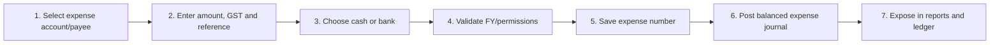

- Accounting effect: Debit expense/input GST; credit cash/bank
- Stock effect: None
- Main records: expenses, journal_entries, journal_lines, audit_log
- Key controls: Balanced posting, FY lock, role permission

## 17. Credit Note, Sales Return and Refund

**Status:** IMPLEMENTED  
**Actors:** Owner, finance  
**Purpose:** Reduces a customer sale, tax and outstanding amount; optional refund payment and stock return are linked to the original invoice.

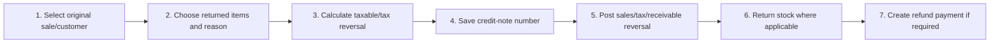

- Accounting effect: Debit sales/output tax; credit receivable; optional refund posting
- Stock effect: Quantity in for returned inventory
- Main records: credit_debit_notes(note_type=credit), payments, stock_movements
- Key controls: Original bill link, amount validation, owner controls

## 18. Debit Note and Purchase Return

**Status:** IMPLEMENTED  
**Actors:** Owner, finance  
**Purpose:** Records goods/value returned to a supplier and reduces purchase/input-tax or payable effects.

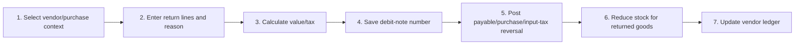

- Accounting effect: Debit payable; credit purchases/input GST
- Stock effect: Quantity out for purchase return lines
- Main records: credit_debit_notes(note_type=debit), journal_entries, stock_movements
- Key controls: FY lock, balanced journal, audit and number non-reuse

## 19. Manual Journal and Financial-Year Closing

**Status:** IMPLEMENTED  
**Actors:** Owner, accountant  
**Purpose:** Posts controlled debit/credit adjustments and locks completed financial years against later transaction changes.

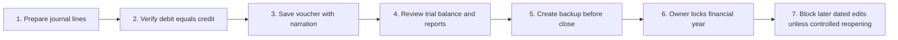

- Accounting effect: Direct balanced journal and year-end adjustments
- Stock effect: None unless separately rebuilt from source documents
- Main records: journal_entries, journal_lines, financial_year_locks, backup_log
- Key controls: Owner/accountant only, balanced totals, lock audit

## 20. Bank Statement Import and Reconciliation

**Status:** IMPLEMENTED  
**Actors:** Owner, accountant  
**Purpose:** Imports XLSX/CSV statement rows with duplicate protection and matches each row to a recorded journal line.

```mermaid
flowchart LR
  S1["1. Upload bank statement"]
  S2["2. Hash and reject duplicate import"]
  S3["3. Parse statement rows"]
  S4["4. Search matching software entry"]
  S5["5. Confirm journal-line match"]
  S6["6. Store reconciliation state"]
  S7["7. Review unmatched rows"]
  S1 --> S2 --> S3 --> S4 --> S5 --> S6 --> S7
```

- Accounting effect: No new posting from match itself
- Stock effect: None
- Main records: bank_statement_imports, bank_statement_rows, bank_reconciliation
- Key controls: File hash, organization scope, reversible match audit

## 21. GST Reports and GSTR-2B Matching

**Status:** IMPLEMENTED  
**Actors:** Owner, accountant  
**Purpose:** Builds sales GST summaries and compares imported GSTR-2B purchase rows with Tarangini purchase records.

```mermaid
flowchart LR
  S1["1. Read saved tax invoices and notes"]
  S2["2. Group GSTIN, HSN and tax values"]
  S3["3. Import GSTR-2B data"]
  S4["4. Match supplier invoice/date/value"]
  S5["5. Flag matched and unmatched rows"]
  S6["6. Export reports for review"]
  S7["7. Accountant files outside Tarangini"]
  S1 --> S2 --> S3 --> S4 --> S5 --> S6 --> S7
```

- Accounting effect: Reports existing postings; no automatic filing journal
- Stock effect: None
- Main records: bills, purchases, credit_debit_notes, gstr2b_imports/rows
- Key controls: GSTIN/date/value validation and accountant review

## 22. GST E-Invoice Registration

**Status:** PROPOSED - NOT BUILT  
**Actors:** Owner/finance, IRP or authorized GSP  
**Purpose:** Proposed online submission of an eligible saved invoice to obtain IRN, acknowledgement and signed QR data.

```mermaid
flowchart LR
  S1["1. Create and validate eligible invoice"]
  S2["2. Owner confirms GST submission"]
  S3["3. Send idempotent JSON to IRP/GSP"]
  S4["4. Receive or reconcile IRN response"]
  S5["5. Store IRN, acknowledgement and signed QR"]
  S6["6. Lock GST-critical invoice fields"]
  S7["7. Print invoice with official QR"]
  S1 --> S2 --> S3 --> S4 --> S5 --> S6 --> S7
  classDef proposed fill:#fff2d8,stroke:#e9a23b,color:#243b53;
  class S1,S2,S3,S4,S5,S6,S7 proposed;
```

- Accounting effect: Uses existing saved invoice posting
- Stock effect: Uses existing invoice stock movement
- Main records: Proposed GST submission/request/response records linked to bill_id
- Key controls: Online only, encrypted credentials, duplicate reconciliation, cancellation rules

## 23. GST E-Way Bill Generation and Cancellation

**Status:** PROPOSED - NOT BUILT  
**Actors:** Owner/dispatch, transporter, E-Way Bill API  
**Purpose:** Proposed goods-movement process using invoice/challan, dispatch, transporter, vehicle and distance details.

```mermaid
flowchart LR
  S1["1. Check applicability/exemption"]
  S2["2. Capture dispatch/ship-to and transporter"]
  S3["3. Validate vehicle, distance and document"]
  S4["4. Submit idempotent EWB request"]
  S5["5. Store EWB number and validity"]
  S6["6. Print/share movement document"]
  S7["7. Update vehicle or cancel under permitted rules"]
  S1 --> S2 --> S3 --> S4 --> S5 --> S6 --> S7
  classDef proposed fill:#fff2d8,stroke:#e9a23b,color:#243b53;
  class S1,S2,S3,S4,S5,S6,S7 proposed;
```

- Accounting effect: No additional journal
- Stock effect: References existing dispatch/sale movement
- Main records: Proposed EWB request/response/history linked to bill/DC
- Key controls: Online API, state/job-work rules, expiry and cancellation audit

## 24. Customer QR Intake, Upload and PDF Analysis

**Status:** IMPLEMENTED  
**Actors:** Customer, owner/counter  
**Purpose:** Accepts a LAN customer request, contact details, service selection, consent and files, then returns a unique order ID.

```mermaid
flowchart LR
  S1["1. Scan QR/open service page"]
  S2["2. Select service and enter customer details"]
  S3["3. Upload and preview files"]
  S4["4. Analyze PDF pages/colour hints"]
  S5["5. Validate consent and required fields"]
  S6["6. Create/reuse party and intake request"]
  S7["7. Return unique order ID"]
  S1 --> S2 --> S3 --> S4 --> S5 --> S6 --> S7
```

- Accounting effect: None
- Stock effect: None
- Main records: job_intake_requests, job_intake_attachments, parties, analysis jobs
- Key controls: Idempotency key, file limits, metadata/hash, required-field focus

## 25. Intake Review and Job Creation

**Status:** IMPLEMENTED  
**Actors:** Owner, counter  
**Purpose:** Reviews the customer submission, corrects commercial details and converts it once into a uniquely numbered job order.

```mermaid
flowchart LR
  S1["1. Open intake review queue"]
  S2["2. Verify party/service/files"]
  S3["3. Add job item and estimate details"]
  S4["4. Convert intake"]
  S5["5. Create job token, items and estimate"]
  S6["6. Copy attachment metadata"]
  S7["7. Link intake to job and audit"]
  S1 --> S2 --> S3 --> S4 --> S5 --> S6 --> S7
```

- Accounting effect: None until job billing
- Stock effect: None until material consumption
- Main records: job_orders, job_items, job_estimates, job_attachments
- Key controls: One conversion per intake; organization and party linkage

## 26. Estimate, Quotation and Customer Approval

**Status:** IMPLEMENTED  
**Actors:** Owner/finance, customer  
**Purpose:** Stores job estimate versions and exposes the accepted quotation and later additional-work decisions to the customer portal.

```mermaid
flowchart LR
  S1["1. Prepare estimate lines"]
  S2["2. Owner/finance sets customer price"]
  S3["3. Publish accepted quotation"]
  S4["4. Customer opens secure portal"]
  S5["5. Customer reviews amount/terms"]
  S6["6. Record approval/rejection and consent"]
  S7["7. Preserve estimate/audit history"]
  S1 --> S2 --> S3 --> S4 --> S5 --> S6 --> S7
```

- Accounting effect: None until first/final bill
- Stock effect: None
- Main records: job_estimates, job_customer_approvals, job_audit_events
- Key controls: Version/history, secure token, immutable decision evidence

## 27. Job Assignment and Operator Response

**Status:** IMPLEMENTED  
**Actors:** Owner/senior operator, assigned employee  
**Purpose:** Routes a job to the responsible operator/engineer and records acceptance, decline, handoff and instructions.

```mermaid
flowchart LR
  S1["1. Owner selects job and employee"]
  S2["2. Create pending assignment"]
  S3["3. Notify/show employee queue"]
  S4["4. Employee accepts or declines"]
  S5["5. Record response/reason"]
  S6["6. Activate accepted responsibility"]
  S7["7. Write status and audit event"]
  S1 --> S2 --> S3 --> S4 --> S5 --> S6 --> S7
```

- Accounting effect: None
- Stock effect: None
- Main records: job_assignments, job_status_events, job_audit_events
- Key controls: Assigned-user visibility, delivered-job lock, response history

## 28. Production Status, Work Report and Daily Log

**Status:** IMPLEMENTED  
**Actors:** Operator, engineer, owner  
**Purpose:** Tracks job progress, work performed, pending work, file names and miscellaneous employee activity through daily submission and owner review.

```mermaid
flowchart LR
  S1["1. Start accepted job"]
  S2["2. Update allowed production status"]
  S3["3. Add work-done/pending report"]
  S4["4. Auto-collect job and billing events"]
  S5["5. Add miscellaneous work if needed"]
  S6["6. Submit daily report"]
  S7["7. Owner reviews, returns or reopens"]
  S1 --> S2 --> S3 --> S4 --> S5 --> S6 --> S7
```

- Accounting effect: None directly
- Stock effect: Only when separate material transaction is recorded
- Main records: job_status_events, job_work_reports, operator_daily_logs/entries
- Key controls: Status transition rules, assignment check, submitted-log lock

## 29. Job Material Consumption

**Status:** IMPLEMENTED  
**Actors:** Assigned operator/engineer  
**Purpose:** Links inventory consumed during production to the specific job and reduces available stock.

```mermaid
flowchart LR
  S1["1. Open assigned active job"]
  S2["2. Select inventory item"]
  S3["3. Enter consumed quantity and note"]
  S4["4. Validate assignment and stock"]
  S5["5. Save job material record"]
  S6["6. Create stock quantity-out movement"]
  S7["7. Audit and show stock warning"]
  S1 --> S2 --> S3 --> S4 --> S5 --> S6 --> S7
```

- Accounting effect: No direct cost journal in current flow
- Stock effect: Quantity out linked to job material source
- Main records: job_material_consumptions, stock_movements, job_audit_events
- Key controls: Accepted assignment, delivered-job lock, item/org validation

## 30. Additional Work, Evidence and Customer Decision

**Status:** IMPLEMENTED  
**Actors:** Operator, finance/owner, customer  
**Purpose:** Captures unexpected additional work, prices it, requests customer approval and includes only approved value in final billing.

```mermaid
flowchart LR
  S1["1. Operator proposes addition with reason"]
  S2["2. Attach evidence metadata"]
  S3["3. Finance sets description, tax and price"]
  S4["4. Publish awaiting-customer request"]
  S5["5. Customer approves or rejects"]
  S6["6. Store decision and evidence hash"]
  S7["7. Include approved addition in final bill"]
  S1 --> S2 --> S3 --> S4 --> S5 --> S6 --> S7
```

- Accounting effect: None until included in bill
- Stock effect: Separate material records handle consumption
- Main records: job_additions, job_attachments, job_customer_approvals
- Key controls: Price permission, secure customer token, decision audit

## 31. First Bill, Final Invoice, Delivery and Collection

**Status:** IMPLEMENTED  
**Actors:** Owner, finance, counter, customer  
**Purpose:** Links job and invoice IDs, reuses a matching first bill, prevents duplicate final billing, records delivery and applies receipt payments.

```mermaid
flowchart LR
  S1["1. Create optional first bill from estimate"]
  S2["2. Complete production and quality check"]
  S3["3. Mark ready for delivery"]
  S4["4. Compare accepted estimate/additions to first bill"]
  S5["5. Reuse bill or create one final SALE"]
  S6["6. Record receiver and payment"]
  S7["7. Set DELIVERED and schedule retention"]
  S1 --> S2 --> S3 --> S4 --> S5 --> S6 --> S7
```

- Accounting effect: Sale posting plus any receipt postings
- Stock effect: Invoice product lines/material transactions retain their movements
- Main records: job_orders, bills, payments, delivery acknowledgements, audit
- Key controls: One final_bill_id, amount comparison, delivered-job lock

## 32. Order Tracking, Quotation and Output Preview

**Status:** IMPLEMENTED  
**Actors:** Customer  
**Purpose:** Lets the customer use order ID/secure token to see status, quotation, approvals, invoice/payment state and permitted inline previews.

```mermaid
flowchart LR
  S1["1. Enter tracking identity/open secure link"]
  S2["2. Validate order/token and expiry"]
  S3["3. Load job timeline and quotation"]
  S4["4. Show invoice/payment status"]
  S5["5. Show customer-visible attachment metadata"]
  S6["6. Stream retained file inline"]
  S7["7. Record customer decision/upload audit"]
  S1 --> S2 --> S3 --> S4 --> S5 --> S6 --> S7
```

- Accounting effect: Read-only visibility of linked invoice/payment state
- Stock effect: None
- Main records: job access tokens, job status, approvals, attachments, messages
- Key controls: No cross-job access, no download button, visibility/retention checks

## 33. Attachment Analysis, Archive and Retention

**Status:** IMPLEMENTED  
**Actors:** Customer, operator, owner, retention worker  
**Purpose:** Stores controlled job files, retains metadata, analyzes PDF/images and deletes non-archived bytes seven days after completed delivery.

```mermaid
flowchart LR
  S1["1. Receive and hash upload"]
  S2["2. Store bytes and metadata"]
  S3["3. Analyze pages/colour/dimensions"]
  S4["4. Mark customer preview visibility"]
  S5["5. Owner optionally archives important file"]
  S6["6. Retention worker finds expired files"]
  S7["7. Delete bytes but retain filename/hash/audit"]
  S1 --> S2 --> S3 --> S4 --> S5 --> S6 --> S7
```

- Accounting effect: None
- Stock effect: None
- Main records: job_attachments, intake_attachments, attachment_analysis_jobs
- Key controls: File limits, path safety, archive exception, metadata retention

## 34. Warranty Replacement and Service-Center Tracking

**Status:** IMPLEMENTED  
**Actors:** Owner, counter, operator, vendor/service center  
**Purpose:** Tracks a faulty sold product from customer receipt through delivery challan, courier/RMA follow-up and final resolution.

```mermaid
flowchart LR
  S1["1. Select customer and original sale"]
  S2["2. Record product, serial and fault"]
  S3["3. Check warranty/service-center category"]
  S4["4. Create/link delivery challan"]
  S5["5. Record courier tracking and RMA"]
  S6["6. Follow status/date with vendor"]
  S7["7. Resolve and return/close case"]
  S1 --> S2 --> S3 --> S4 --> S5 --> S6 --> S7
```

- Accounting effect: No automatic journal; linked billing remains separate
- Stock effect: No automatic movement beyond linked transaction
- Main records: warranty_replacements, warranty_service_centers, bills, audit_log
- Key controls: Unique WR number, party/bill validation, serial required

## 35. Shift, Held Bill and Day-End Acceptance

**Status:** IMPLEMENTED  
**Actors:** Cashier, owner  
**Purpose:** Tracks counter opening, parked carts, shift-linked invoices/payments, counted cash, variance and owner acceptance.

```mermaid
flowchart LR
  S1["1. Open shift with opening cash"]
  S2["2. Create/resume held carts"]
  S3["3. Save invoices and collections to shift"]
  S4["4. Calculate promised versus collected modes"]
  S5["5. Cashier enters closing counts"]
  S6["6. Close shift and show variance"]
  S7["7. Owner accepts and audits"]
  S1 --> S2 --> S3 --> S4 --> S5 --> S6 --> S7
```

- Accounting effect: Invoices/payments post normally; shift summarizes them
- Stock effect: Invoices post normal stock movements
- Main records: pos_shifts, held_bills, bills, payments
- Key controls: One active shift rules, close/accept states, owner review

## 36. Client Offline Queue and Main-System Synchronization

**Status:** IMPLEMENTED - LIMITED SAFE SCOPE  
**Actors:** Client PC, Main System, owner  
**Purpose:** Allows approved document drafts such as quotations to queue locally, then synchronizes idempotently when the single Main System returns.

```mermaid
flowchart LR
  S1["1. Client health check fails"]
  S2["2. Enter limited offline mode"]
  S3["3. Save permitted local document with device identity"]
  S4["4. Show pending item in local register"]
  S5["5. Discover/reconnect Main System"]
  S6["6. Replay with idempotency and unique numbering"]
  S7["7. Mark synced or conflict for owner"]
  S1 --> S2 --> S3 --> S4 --> S5 --> S6 --> S7
```

- Accounting effect: Final accounting writes remain Main-System controlled
- Stock effect: Stock-changing offline writes remain restricted
- Main records: Client queue/cache plus server bills/audit after sync
- Key controls: Stable device ID, retry idempotency, one Main System, conflict lock

## 37. Manual Migration Backup, Encrypted Backup and Restore

**Status:** IMPLEMENTED  
**Actors:** Owner, automatic backup service  
**Purpose:** Creates migration JSON or encrypted full-database backups, verifies history and rebuilds mappings/accounting during controlled restore.

```mermaid
flowchart LR
  S1["1. Checkpoint/validate live database"]
  S2["2. Choose JSON export or encrypted DB backup"]
  S3["3. Write to separate backup location"]
  S4["4. Record hash/result in backup log"]
  S5["5. Select verified backup for restore"]
  S6["6. Restore/map entities and rebuild journals"]
  S7["7. Run integrity and restore tests"]
  S1 --> S2 --> S3 --> S4 --> S5 --> S6 --> S7
```

- Accounting effect: All accounting data preserved/rebuilt
- Stock effect: All source movements preserved/rebuilt
- Main records: All business tables, backup_log, data_shift batches/maps
- Key controls: Recovery key, separate disk, pre-upgrade backup, integrity check

## 38. Public Customer Website Transaction

**Status:** PROPOSED - NOT BUILT  
**Actors:** Internet customer, cloud API, Main System  
**Purpose:** Proposed public HTTPS intake and tracking service that syncs controlled records without exposing SQLite or the LAN server to the internet.

```mermaid
flowchart LR
  S1["1. Customer opens HTTPS website"]
  S2["2. OTP/rate-limit and organization selection"]
  S3["3. Submit intake using idempotency key"]
  S4["4. Upload to private object storage"]
  S5["5. Cloud queue validates and scans"]
  S6["6. Controlled connector syncs to Main System"]
  S7["7. Customer tracks status from safe projection"]
  S1 --> S2 --> S3 --> S4 --> S5 --> S6 --> S7
  classDef proposed fill:#fff2d8,stroke:#e9a23b,color:#243b53;
  class S1,S2,S3,S4,S5,S6,S7 proposed;
```

- Accounting effect: No public direct accounting write in first rollout
- Stock effect: No public direct stock write
- Main records: Proposed cloud intake/upload/status projection plus mapped local IDs
- Key controls: HTTPS, WAF/rate limit, org isolation, signed preview, conflict queue

## 39. Android Customer and Staff Application

**Status:** PROPOSED - NOT BUILT  
**Actors:** Customer/staff app, public API, Main System  
**Purpose:** Proposed Android client using the same versioned APIs as the website with an encrypted local cache and controlled background synchronization.

```mermaid
flowchart LR
  S1["1. Install signed Android app"]
  S2["2. Authenticate customer or staff role"]
  S3["3. Read/write only permitted API resources"]
  S4["4. Cache safe data locally"]
  S5["5. Queue permitted offline action"]
  S6["6. Background sync with idempotency/version check"]
  S7["7. Resolve conflict or refresh server truth"]
  S1 --> S2 --> S3 --> S4 --> S5 --> S6 --> S7
  classDef proposed fill:#fff2d8,stroke:#e9a23b,color:#243b53;
  class S1,S2,S3,S4,S5,S6,S7 proposed;
```

- Accounting effect: Remote billing only after separate approval/security phase
- Stock effect: No unsafe offline stock writes
- Main records: Same API IDs: org, party, item, job, bill and payment references
- Key controls: HTTPS, token rotation, device security, RBAC, no shared database
