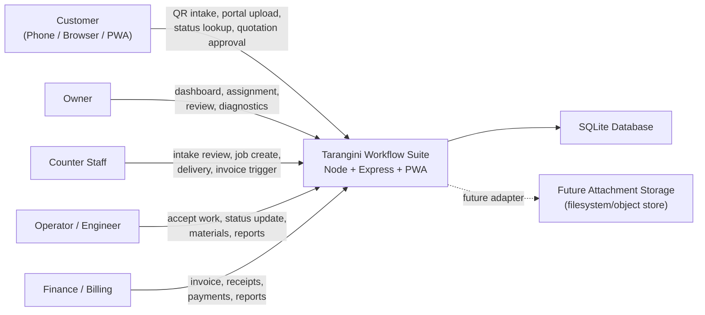
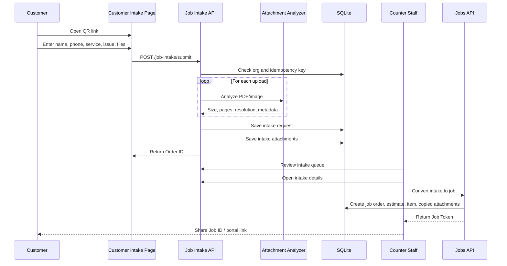
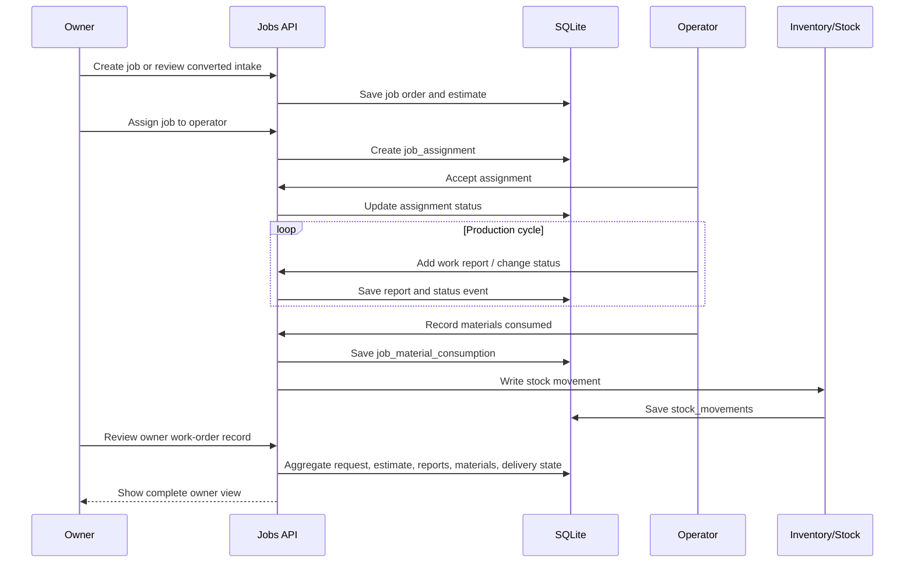
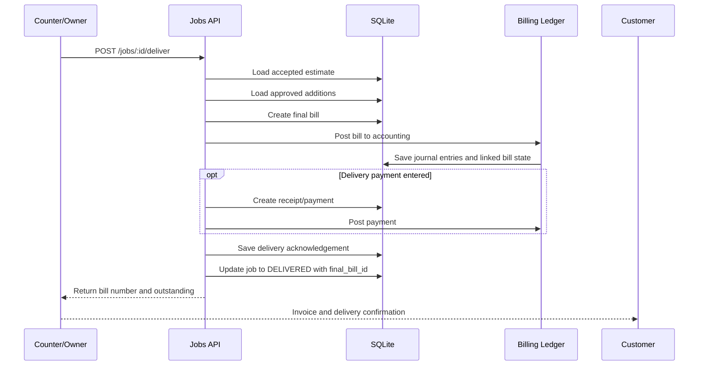
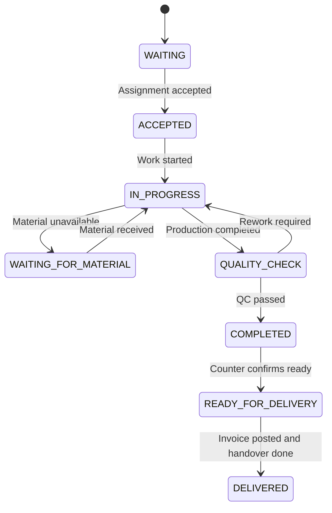
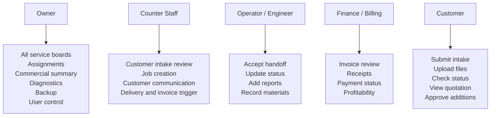
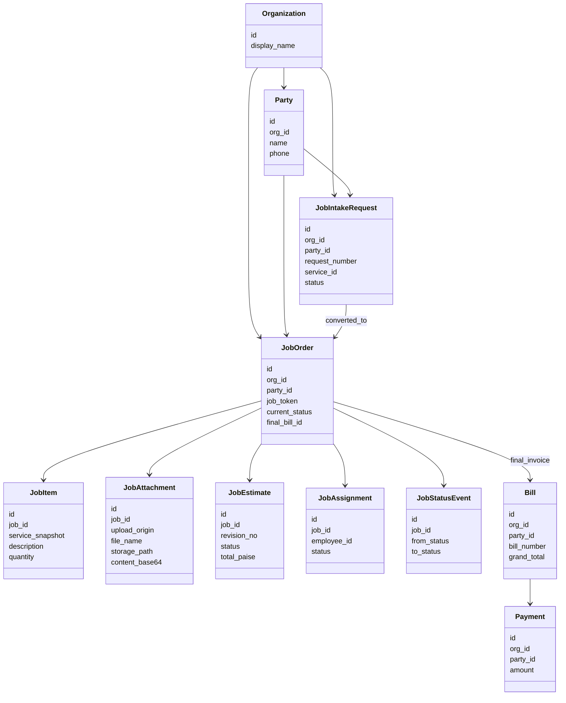

# Tarangini Workflow Suite v1.0 Audit And UML

Audit date: 2026-06-24

Scope reviewed:

- `server.js`
- `src/db/*`
- `src/routes/job-intake.js`
- `src/routes/job-portal.js`
- `src/routes/jobs.js`
- `src/routes/advanced.js`
- `src/services/attachment-analysis.js`
- existing architecture and deployment documentation

Validation baseline:

- `npm.cmd run test:review` passed before the `v1.0.0` build
- installer build completed successfully as `Tarangini Workflow Suite Setup 1.0.0.exe`

## Audit Findings

### P1: Attachment storage mode is declared as future-ready, but the live write path still stores upload bytes inline in SQLite

Why this matters:

- the deployment profile advertises `attachment_storage_mode`
- the schema already has `storage_path`
- but customer and staff uploads still write full `content_base64` into the database hot path
- this will inflate database size, memory pressure, backup size, restore time, and upload latency as online traffic grows

Key references:

- `src/config/deployment-profile.js` declares `attachment_storage_mode`: lines 12-23
- `src/db/schema.sql` has both `storage_path` and `content_base64`: lines 688-700
- `src/routes/job-intake.js` stores intake attachments inline: lines 462-548
- `src/routes/job-portal.js` stores portal uploads inline: lines 143-183
- `src/routes/jobs.js` stores staff uploads inline: lines 117-140

Recommendation:

- implement a real storage adapter behind `attachment_storage_mode`
- keep metadata in SQLite, move bytes to filesystem or object storage
- preserve current API shape so Android app and website clients do not need a contract rewrite later

### P1: Upload analysis remains synchronous in the request path and combines badly with SQLite write locking

Why this matters:

- PDF and image analysis happen before request completion
- intake submission loops through attachments one by one
- the database transaction uses `BEGIN IMMEDIATE`, which serializes writers aggressively
- under simultaneous customer uploads, one heavier request can delay others

Key references:

- request-time PDF and image analysis: `src/services/attachment-analysis.js` lines 114-203
- intake submission analyzes attachments inside request handling: `src/routes/job-intake.js` lines 460-487
- SQLite transaction begins with `BEGIN IMMEDIATE`: `src/db/db.js` lines 78-96

Recommendation:

- move heavy attachment analysis to a background queue or staged-processing workflow
- keep intake submit fast by saving metadata and a pending-analysis state first
- reserve synchronous analysis only for small or explicitly preview-only operations

### P2: The default customer portal rate limit does not match the stated 100-200 shared-customer readiness target

Why this matters:

- current default is `180` requests per `15` minutes per IP
- store Wi-Fi customers may share one external IP
- multiple retries, status checks, PDF analyzer calls, and uploads can hit the same limiter

Key references:

- profile default: `src/config/deployment-profile.js` line 11
- limiter wiring: `server.js` lines 173-176

Recommendation:

- tune production defaults for store-NAT and public-internet cases separately
- move from simple per-IP limiting to a mix of IP, token, route-class, and upload-cost controls
- document a recommended public profile before Android/web rollout

### P2: Database read failures can be silently hidden by `all()`, which returns an empty array on SQL errors

Why this matters:

- route handlers can misread query failures as "no data"
- this makes operational debugging harder
- under schema drift or damaged SQL, the UI may look empty instead of clearly broken

Key references:

- `src/db/db.js` lines 63-69

Recommendation:

- stop swallowing SQL errors in shared helpers
- return explicit failures for API reads, or at minimum log and rethrow in production paths
- reserve empty-array fallback only for non-critical diagnostics if needed

## Architecture Snapshot

- Single Node/Express application serves desktop, browser, customer portal and PWA clients.
- SQLite is the system of record for billing, jobs, stock, portal state, and audit records.
- Billing and job workflow are linked at delivery using `job_id`, `job_token`, `party_id`, `final_bill_id`, and payment allocations.
- Customer intake and portal uploads already preserve PDF-analysis and image-resolution metadata.
- Owner, counter, operator, finance and customer paths are separated mostly by route permissions and token-based customer access.

## UML Diagrams

### 1. System Context

### 2. Customer Intake To Job Creation

### 3. Owner And Operator Workflow

### 4. Delivery, Billing And Payment Linkage

### 5. Job Status State Machine

### 6. Role-Wise Access View

### 7. Core Data Model

## Suggested Next Engineering Step

If the goal is true online readiness for Android app and website traffic, the next highest-value upgrade is:

1. Implement real attachment storage abstraction.
2. Move upload analysis to asynchronous processing.
3. Introduce environment-specific production profiles for local LAN, store Wi-Fi, and public internet.
