# Tarangini Workflow Suite - Complete UML And Process Map

Version: 1.0.0  
Scope: Billing, accounting, inventory, production workflow, customer portal, backup, security, diagnostics and deployment.

This document is split into department-wise and transaction-wise UML diagrams. A single diagram for the whole tool would be too dense, so each process is shown separately and linked through common entities: `org_id`, `party_id`, `item_id`, `job_id`, `bill_id`, `payment_id`, `fy`, audit records and stock/accounting references.

## 1. Whole Tool Component UML

```mermaid
flowchart TB
  subgraph Clients["Client Interfaces"]
    Desktop["Desktop App / Electron Shell"]
    Browser["LAN Browser Clients"]
    CustomerIntake["Customer Intake QR Page"]
    CustomerPortal["Customer Job Portal"]
    FutureMobile["Future Android / PWA"]
  end

  subgraph Api["Express API Server"]
    Auth["Auth / PIN / Sessions"]
    Orgs["Company / Transaction Controls"]
    Masters["Parties / Items / Categories"]
    Billing["Billing / Invoices / POS"]
    Accounting["Accounting / Reports / Ledger"]
    Inventory["Stock / Materials"]
    Jobs["Job Order Workflow"]
    Intake["Customer Intake"]
    Portal["Customer Portal API"]
    Backup["Backup / Restore / Data Shift"]
    Advanced["Maintenance / Updates / Diagnostics"]
  end

  subgraph Services["Internal Services"]
    Db["SQLite WAL Database"]
    Postings["Accounting Posting Engine"]
    StockSvc["Stock Movement Engine"]
    AttachmentStore["Attachment Storage"]
    PdfAnalysis["Image/PDF Analyzer"]
    Retention["Attachment Retention Worker"]
    AutoBackup["Automatic Encrypted Backup"]
    Audit["Audit / Data Shift Logs"]
    Sync["Server Sent Events Sync"]
  end

  Desktop --> Api
  Browser --> Api
  CustomerIntake --> Intake
  CustomerPortal --> Portal
  FutureMobile -.future.-> Api

  Api --> Db
  Billing --> Postings
  Billing --> StockSvc
  Jobs --> Postings
  Jobs --> StockSvc
  Jobs --> AttachmentStore
  Intake --> AttachmentStore
  Portal --> AttachmentStore
  AttachmentStore --> PdfAnalysis
  Retention --> AttachmentStore
  Backup --> Db
  Backup --> Audit
  AutoBackup --> Db
  Api --> Sync
```

## 2. Main Actors And Permissions

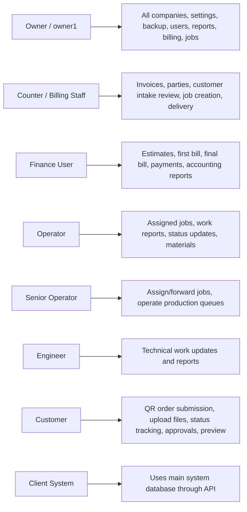

## 3. High-Level Database Entity UML

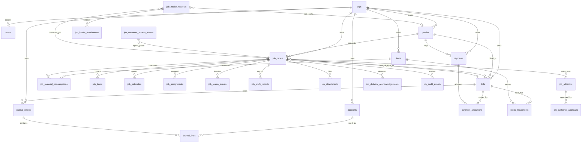

## 4. Complete Customer Intake Process

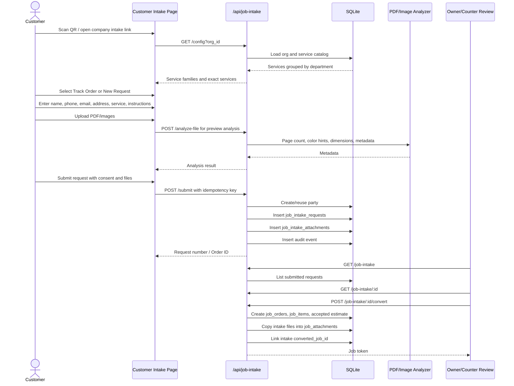

## 5. Job Order Lifecycle UML

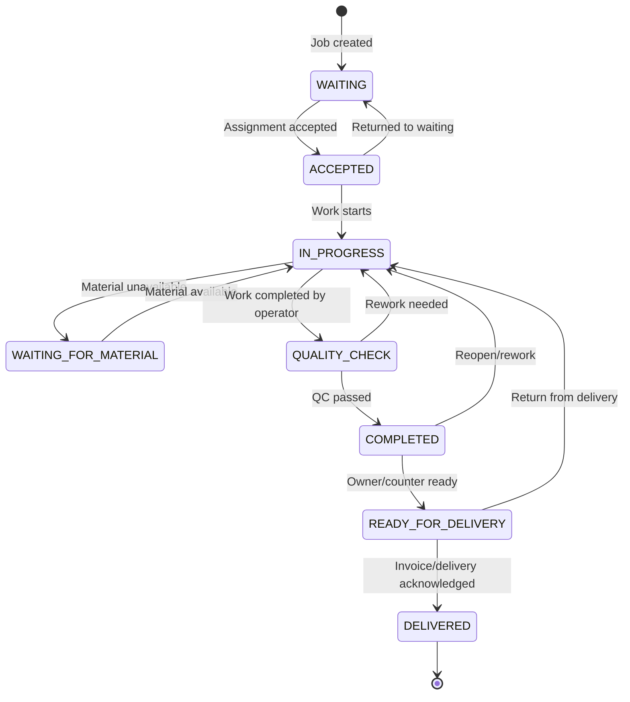

## 6. Job Creation And Estimate Process

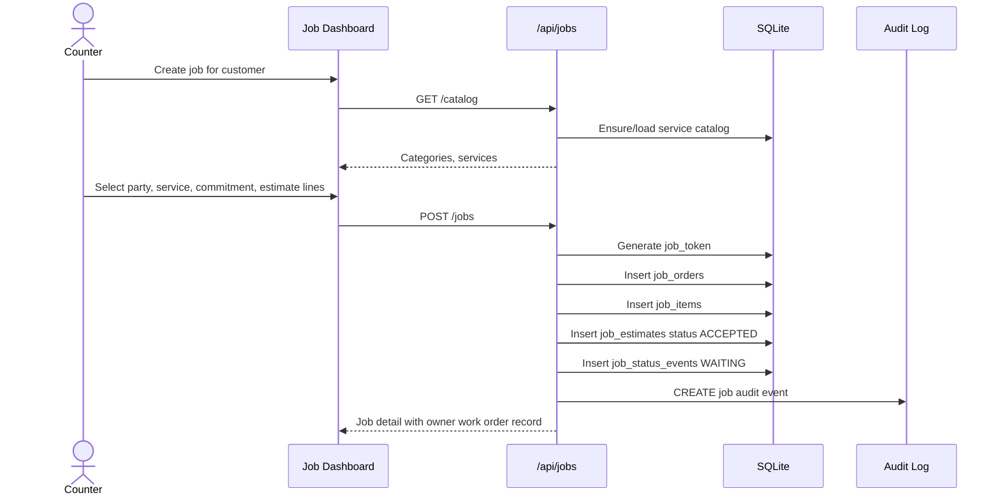

## 7. Assignment And Production Process

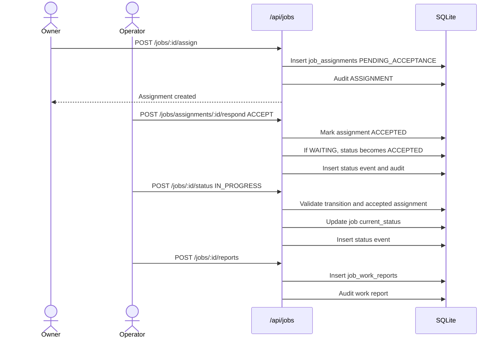

## 8. Materials Consumed And Stock Linkage

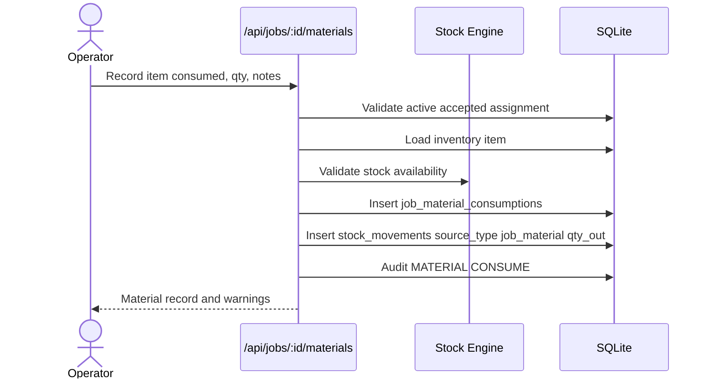

## 9. Additional Work And Customer Approval

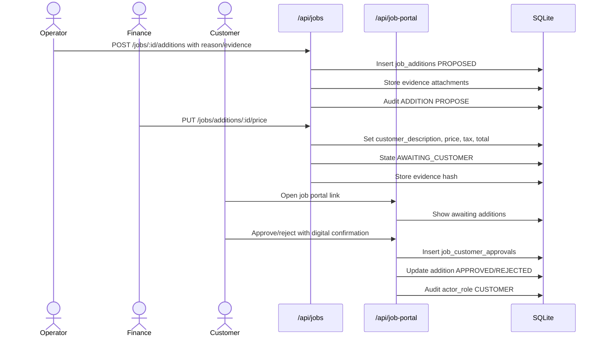

## 10. First Bill / Pre-Bill Linkage

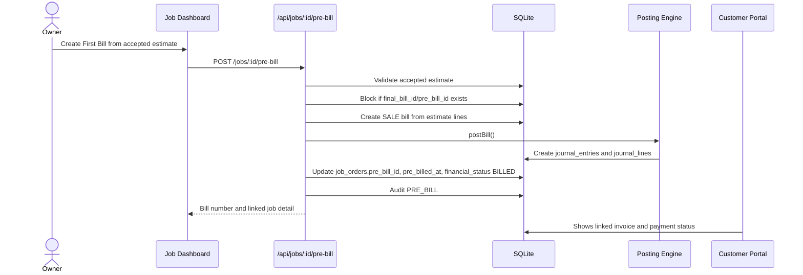

## 11. Delivery And Final Invoice Process

```mermaid
sequenceDiagram
  actor Counter
  participant Jobs as /api/jobs/:id/deliver
  participant DB as SQLite
  participant Accounting as Posting Engine
  participant Retention as Attachment Retention

  Counter->>Jobs: Deliver job with receiver, remarks, payments
  Jobs->>DB: Require READY_FOR_DELIVERY and accepted estimate
  Jobs->>DB: Load approved additions and pre_bill_id

  alt No first bill exists
    Jobs->>DB: Create final SALE bill from estimate + approved additions
    Jobs->>Accounting: postBill()
  else First bill exists and total matches
    Jobs->>DB: Reuse pre_bill as final_bill_id
    Jobs->>DB: Audit PRE_BILL_REUSED
  else First bill exists but amount differs
    Jobs-->>Counter: Block duplicate invoice; request supplementary/correction handling
  end

  Jobs->>DB: Create delivery payment receipts if any
  Jobs->>Accounting: postPayment() for receipts
  Jobs->>DB: Insert job_delivery_acknowledgements
  Jobs->>DB: Update job status DELIVERED, financial status, final_bill_id
  Jobs->>DB: Insert status event and audit DELIVER
  Jobs->>Retention: Schedule 7-day attachment cleanup for non-archived files
```

## 12. Billing / Sales Invoice Transaction

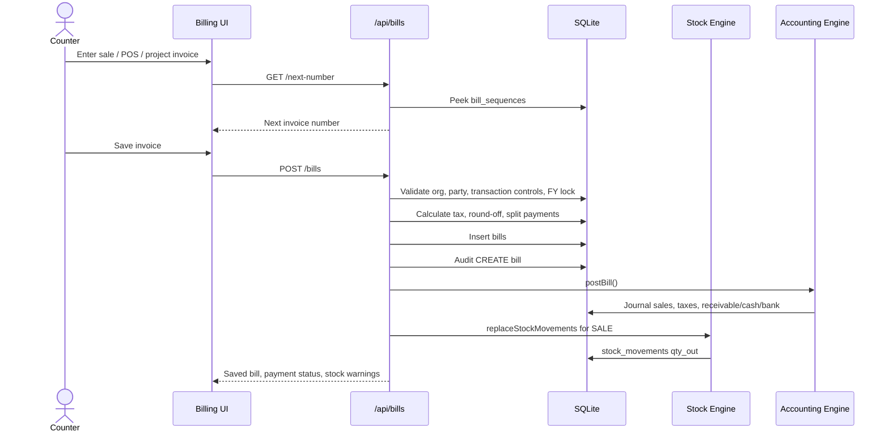

## 13. Bill Edit, Delete, Convert And Correction

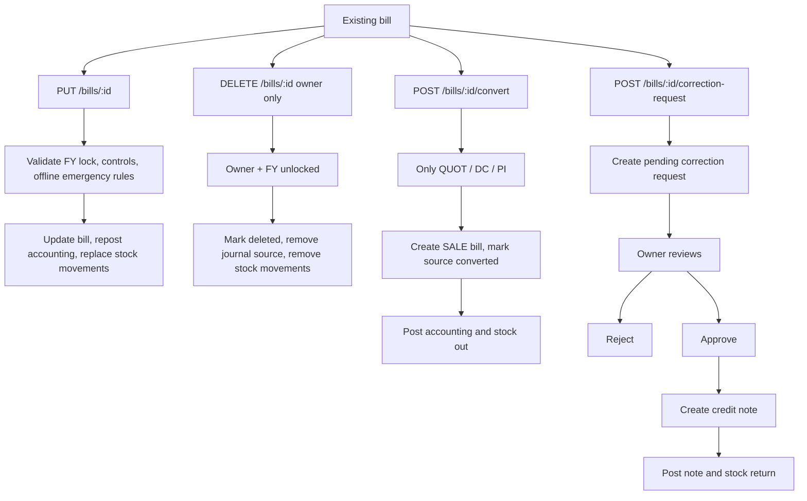

## 14. Payments And Settlement

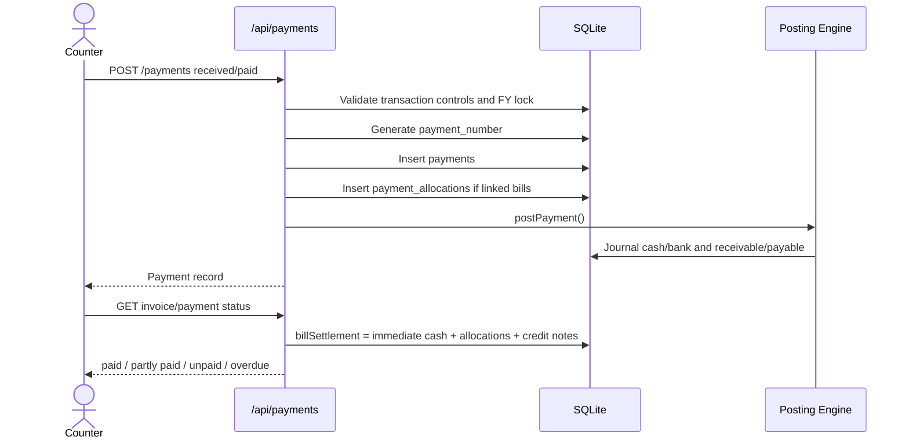

## 15. Purchase, Expense, Notes And Purchase Order

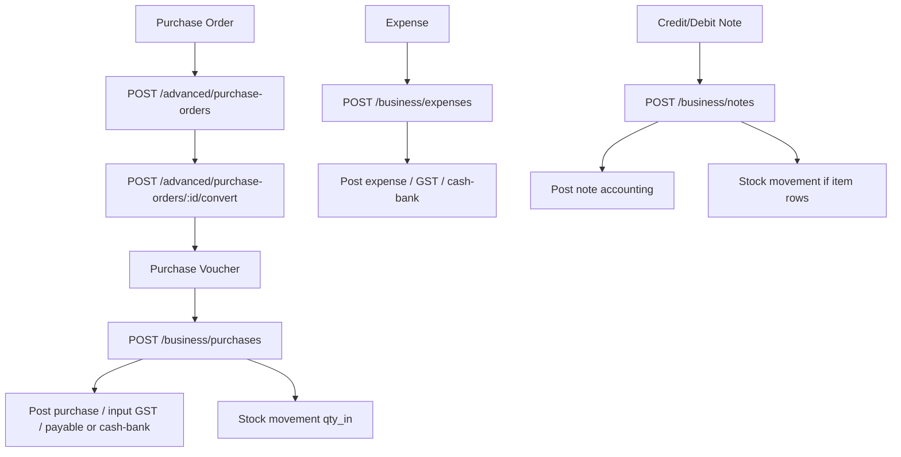

## 16. POS Shift And Held Bills

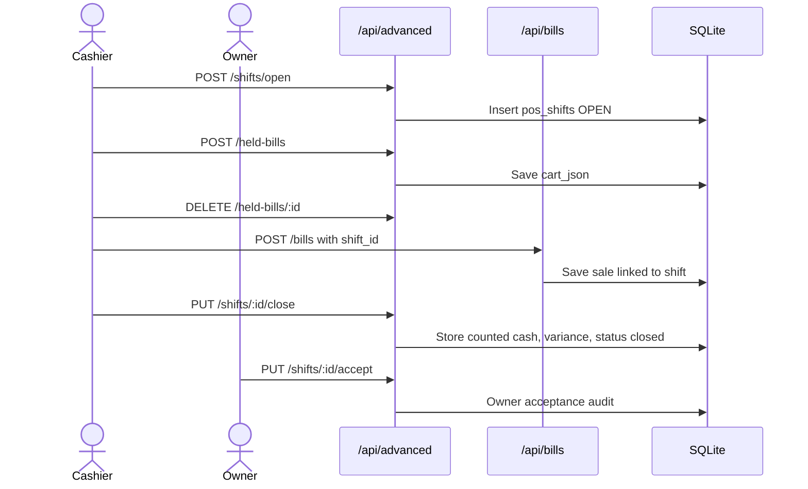

## 17. Inventory And Stock UML

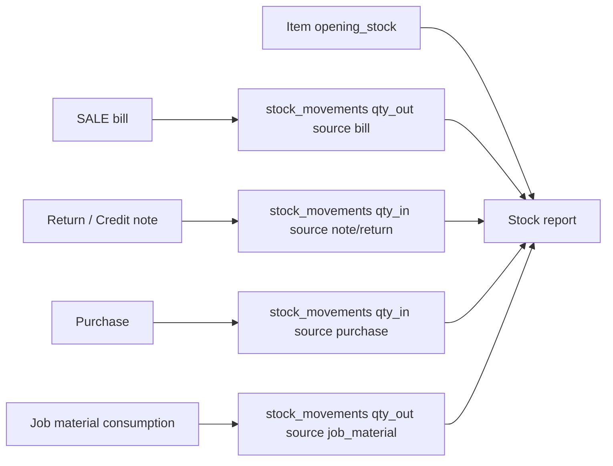

## 18. Accounting Posting UML

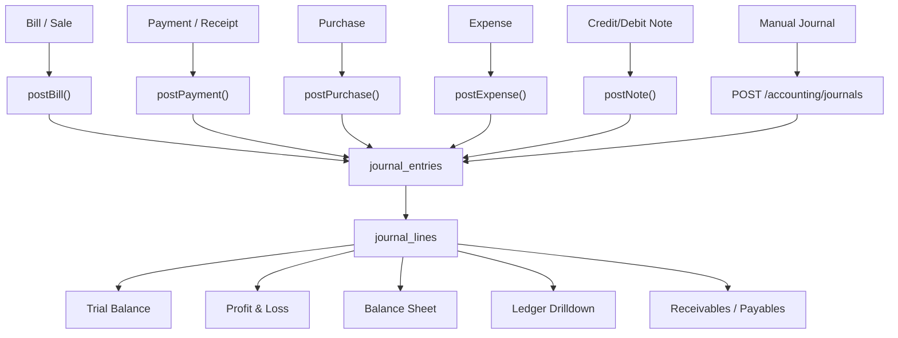

## 19. Bank Statement And Reconciliation

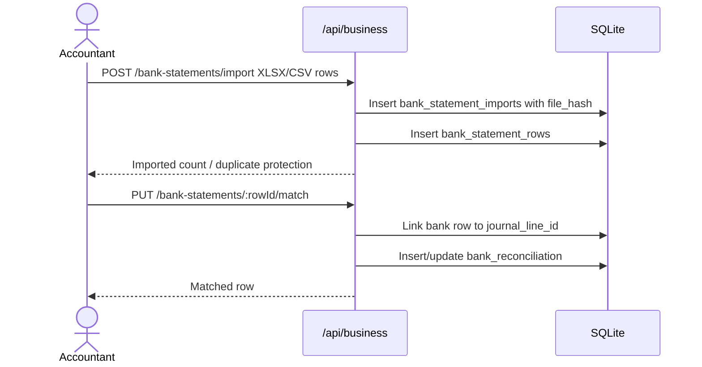

## 20. GST / Reports / Export Processes

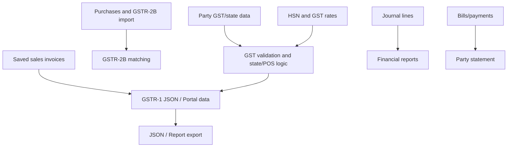

## 21. Customer Portal Job Status And Preview

```mermaid
sequenceDiagram
  actor Customer
  participant PortalPage as customer-job.html
  participant PortalAPI as /api/job-portal/:token
  participant DB as SQLite
  participant Files as Attachment Store

  Customer->>PortalPage: Open secure job token link
  PortalPage->>PortalAPI: GET /:token
  PortalAPI->>DB: Validate token hash, expiry, revoked_at
  PortalAPI->>DB: Load job, items, quotation, additions, visible attachments
  PortalAPI-->>PortalPage: Status, invoice link, payment status, attachments metadata

  Customer->>PortalPage: Preview visible file
  PortalPage->>PortalAPI: GET /attachments/:id/content
  PortalAPI->>DB: Check visible_to_customer
  alt File retained
    PortalAPI->>Files: Load bytes
    PortalAPI-->>PortalPage: Inline preview, no download button
  else File expired
    PortalAPI-->>PortalPage: 410 preview expired, metadata retained
  end

  Customer->>PortalPage: Upload extra file
  PortalPage->>PortalAPI: POST /uploads
  PortalAPI->>Files: Store file
  PortalAPI->>DB: Insert job_attachments and audit
```

## 22. Attachment Storage, Analysis, Retention And Archive

```mermaid
stateDiagram-v2
  [*] --> ACTIVE: Upload stored
  ACTIVE --> ACTIVE: Analysis pending/ready
  ACTIVE --> ARCHIVED: Owner moves to archive
  ARCHIVED --> ACTIVE: Owner removes archive
  ACTIVE --> DELETED: Retention worker after delivery + 7 days
  DELETED --> [*]: Metadata remains in database
```

```mermaid
sequenceDiagram
  participant Upload as Upload Endpoint
  participant Storage as Attachment Storage
  participant Analyzer as Analyzer Queue/Sync
  participant DB as SQLite
  participant Retention as Retention Worker
  actor Owner

  Upload->>Storage: persistAttachmentBytes()
  Storage-->>Upload: storage_path or inline base64
  Upload->>DB: Insert attachment row and metadata
  Upload->>Analyzer: Analyze image/PDF
  Analyzer->>DB: Update pixel/page/color metadata

  Owner->>DB: Mark archive_attachment=true
  DB-->>Owner: retention_state ARCHIVED

  Retention->>DB: Find ACTIVE expired non-archive files
  Retention->>Storage: Delete physical bytes
  Retention->>DB: retention_state DELETED, keep name/hash/metadata
```

## 23. Backup, Restore And Data Shift

```mermaid
sequenceDiagram
  actor Owner
  participant Backup as /api/backup
  participant DB as SQLite
  participant Shift as Data Shift Maps
  participant Crypto as AES-256-GCM Backup

  Owner->>Backup: GET /export org/fy
  Backup->>DB: Read orgs, parties, items, bills, payments, journals, jobs
  Backup->>DB: Read attachment metadata only
  Backup->>DB: Insert backup_log
  Backup-->>Owner: JSON backup

  Owner->>Backup: POST /import
  Backup->>Shift: Begin data_shift_batch
  Backup->>DB: Upsert orgs, parties, items, bills, payments
  Backup->>DB: Upsert jobs, estimates, assignments, attachments metadata
  Backup->>Shift: Record entity maps
  Backup->>Shift: Finish completed/failed

  Owner->>Backup: POST /run-automatic
  Backup->>DB: saveDB WAL checkpoint
  Backup->>Crypto: Encrypt SQLite DB
  Crypto-->>Backup: .tbe file
```

## 24. Security, Session And Role Flow

```mermaid
sequenceDiagram
  actor User
  participant UI as App UI
  participant Auth as /api/auth
  participant Middleware as Auth Middleware
  participant DB as SQLite

  User->>UI: Login username/password
  UI->>Auth: POST /login
  Auth->>DB: Verify bcrypt password and active user
  Auth->>DB: Create session/token
  Auth-->>UI: JWT/session user permissions

  UI->>Middleware: API request with bearer token
  Middleware->>DB: Validate session, org access, role permission
  alt Allowed
    Middleware-->>UI: Route response
  else Blocked
    Middleware-->>UI: 401/403/421/426
  end

  User->>UI: PIN unlock / change password / change PIN
  UI->>Auth: Secure auth endpoint
  Auth->>DB: Update hashes and audit
```

## 25. Sync Between Main And Client Systems

```mermaid
sequenceDiagram
  participant Main as Main System API
  participant ClientA as Client Browser A
  participant ClientB as Client Browser B
  participant DB as SQLite

  ClientA->>Main: POST/PUT/PATCH/DELETE transaction
  Main->>DB: Commit data
  Main->>Main: Increment revision
  Main-->>ClientA: Success
  Main-->>ClientB: SSE /api/sync/events revision changed
  ClientB->>Main: Refresh affected data
```

## 26. Update Package And Installer Process

```mermaid
flowchart TB
  Build["npm run dist"] --> Installer["NSIS Installer EXE"]
  Build --> Zip["Portable ZIP"]
  Installer --> Hash["SHA-256 recorded"]
  Zip --> Hash
  OwnerUpload["Owner uploads update package"] --> UpdatePackages["update_packages table"]
  UpdatePackages --> Verify["SHA-256 verification"]
  Verify --> Download["LAN clients download verified installer"]
  Download --> Install["Controlled installation"]
```

## 27. Full Transaction Matrix

| Area | Transaction / Process | Main API | Main Tables | Accounting Impact | Stock Impact | Audit |
|---|---|---|---|---|---|---|
| Auth | Login | `POST /api/auth/login` | `users`, `sessions` | No | No | Session/login metadata |
| Auth | Change password/PIN | `/api/auth/change-*` | `users`, `audit_log` | No | No | Yes |
| Company | Create/update org | `/api/orgs` | `orgs`, `transaction_control_settings` | No | No | Yes |
| Masters | Party create/update | `/api/parties` | `parties`, `party_org_links` | Opening balance can post | No | Yes |
| Masters | Item create/update | `/api/items` | `items`, `item_categories` | No | Opening stock affects stock report | Yes |
| Billing | Sale/POS invoice | `POST /api/bills` | `bills`, `bill_sequences` | Sales/tax/cash/bank/receivable journal | SALE qty out | Yes |
| Billing | Edit invoice | `PUT /api/bills/:id` | `bills` | Repost journal | Replace stock movement | Yes |
| Billing | Delete invoice | `DELETE /api/bills/:id` | `bills` | Remove journal source | Remove stock movement | Yes |
| Billing | Convert quotation/DC/PI | `POST /api/bills/:id/convert` | `bills` | New SALE posting | SALE qty out | Yes |
| Billing | Correction request | `POST /api/bills/:id/correction-request` | `invoice_correction_requests` | No until approved | No until approved | Yes |
| Billing | Correction approval | `PUT /api/bills/corrections/:id/review` | `credit_debit_notes` | Credit note posting | Stock return where applicable | Yes |
| Payments | Receipt/payment | `POST /api/payments` | `payments`, `payment_allocations` | Cash/bank and receivable/payable | No | Yes |
| Purchase | Purchase voucher | `POST /api/business/purchases` | `purchases` | Purchase/input tax/payable journal | Qty in | Yes |
| Expense | Expense voucher | `POST /api/business/expenses` | `expenses` | Expense/GST/cash-bank journal | No | Yes |
| Notes | Credit/debit note | `POST /api/business/notes` | `credit_debit_notes` | Note journal | Optional stock movement | Yes |
| POS | Open/close shift | `/api/advanced/shifts` | `pos_shifts` | No direct | No | Yes |
| POS | Held bill | `/api/advanced/held-bills` | `held_bills` | No until invoice | No until invoice | Minimal |
| Job | Create job | `POST /api/jobs` | `job_orders`, `job_items`, `job_estimates` | No | No | Job audit |
| Job | First bill | `POST /api/jobs/:id/pre-bill` | `job_orders`, `bills` | SALE posting | No stock movement from job service lines | Job + bill audit |
| Job | Assign job | `POST /api/jobs/:id/assign` | `job_assignments` | No | No | Job audit |
| Job | Assignment response | `POST /api/jobs/assignments/:id/respond` | `job_assignments`, `job_status_events` | No | No | Job audit |
| Job | Status update | `POST /api/jobs/:id/status` | `job_orders`, `job_status_events` | No | No | Job audit |
| Job | Work report | `POST /api/jobs/:id/reports` | `job_work_reports` | No | No | Job audit |
| Job | Material consumed | `POST /api/jobs/:id/materials` | `job_material_consumptions`, `stock_movements` | No direct | Qty out | Job audit |
| Job | Additional work | `POST /api/jobs/:id/additions` | `job_additions`, `job_attachments` | No until billed | No | Job audit |
| Job | Price addition | `PUT /api/jobs/additions/:id/price` | `job_additions` | No until billed | No | Job audit |
| Job | Customer approval | `/api/job-portal/:token/additions/:id/decision` | `job_customer_approvals`, `job_additions` | No until billed | No | Customer audit |
| Job | Delivery | `POST /api/jobs/:id/deliver` | `job_delivery_acknowledgements`, `job_orders`, `bills`, `payments` | Final/reused bill and receipts | No extra unless invoice item stock exists | Job audit |
| Intake | Customer submit | `POST /api/job-intake/submit` | `job_intake_requests`, `job_intake_attachments`, `parties` | No | No | Intake/job audit |
| Intake | Convert intake | `POST /api/job-intake/:id/convert` | `job_orders`, `job_items`, `job_estimates` | No | No | Job audit |
| Portal | Customer upload | `POST /api/job-portal/:token/uploads` | `job_attachments` | No | No | Customer audit |
| Attachment | Archive/delete lifecycle | `PATCH /api/jobs/attachments/:id`, retention worker | `job_attachments` | No | No | Job audit |
| Accounting | Manual journal | `POST /api/accounting/journals` | `journal_entries`, `journal_lines` | Direct journal | No | Yes |
| Bank | Import statement | `POST /api/business/bank-statements/import` | `bank_statement_imports`, `bank_statement_rows` | No | No | Yes |
| Bank | Match statement | `PUT /api/business/bank-statements/:id/match` | `bank_reconciliation` | No | No | Yes |
| Backup | Manual export/import | `/api/backup/export`, `/api/backup/import` | All business/job tables, `data_shift_*` | Restored | Restored | Data shift audit |
| Backup | Automatic encrypted backup | `/api/backup/run-automatic` | SQLite DB file, `backup_log` | Database copy | Database copy | Yes |
| Maintenance | Integrity/repair | `/api/advanced/integrity`, `/api/advanced/integrity/repair` | Diagnostic tables | Rebuild possible | Rebuild possible | Yes |
| Updates | Update package | `/api/advanced/update-packages` | `update_packages` | No | No | Yes |

## 28. Recommended Reading Order

1. Read diagrams 1-3 for the complete architecture.
2. Read diagrams 4-11 for customer/job production workflow.
3. Read diagrams 12-19 for billing/accounting/inventory transactions.
4. Read diagrams 20-26 for reporting, backup, security, sync and deployment.
5. Use the transaction matrix as the checklist for testing and department training.
